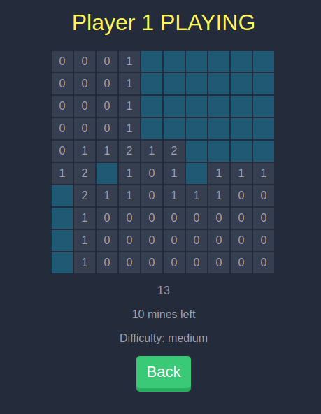

React Minesweeper
=================

This a little code challenge that I took a while ago.

You can check it out live [here](https://frankitox.github.io/minesweeper/).

What you can do:

- Multiplayer capability.
- It can persist the user preferences.
- You can see the history of games played order by difficulty and time.
- Build your custom grid.

Multiplayer capability
----------------------

You can set the amount of players you want. Once a player uncovers
a square, then is the next player's turn. But, it only makes real sense
to have two players at most. If not, you're just determining who didn't
won.

It can persist user preferences
-------------------------------

Simply by storing all the state serialized in localStorage through a
middleware called `storeStateMiddleware` that you can find in `src/storage.js`.

What can be enhanced?
---------------------

- Use web workers to allow offline capability.
- Do coverage testing.
